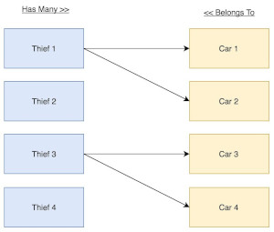

# RELATION 1-M


## Business Rules:

- The Thief can steal many Cars.
- The Car can be stolen by one Thief or none.





## Methods 
### Thief

```php
public function cars() {
    return $this->hasMany(Car::class);
}
```

### Car

```php
public function thief()
{
    return $this->belongsTo(Thief::class);
}
```


### Create relation between Thief and Car.

```php
# Create relation between Thief and Car.
$thief->cars()->saveMany([$car1,$car2,]);

# Or use the save() function for single model.
$thief->cars()->save($car);
```

```php
### Create relation between Car and Thief.
$car->thief()->associate($thief)->save();
```


## filamenthphp

HasMany relationship we have to use the `AssociateAction`, `DeassociateAction`,
or generate relation manager using `--associate` . The Form can be removed.

You can associate multiple Cars with `AssociateAction()-->multiple()`