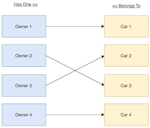

# RELATION 1-1

Business Rules:

-   The **Owner** can own one **Car**.
-   The **Car** can be owned by one **Owner**.
-   A **Owner** can have no **Car**
-   A **Car** has no **Owner**



## Methods

### Owner

```php
public function car() {
    return $this->hasOne(Car::class);
}
```

### Car

```php
public function owner() {
    return $this->belongsTo(Owner::class);
}
```

### Create relation

```php
# add a car to owner
$owner->car()->save($car);
# assign a owner to the car
$car->owner()->associate($owner)->save();
```
